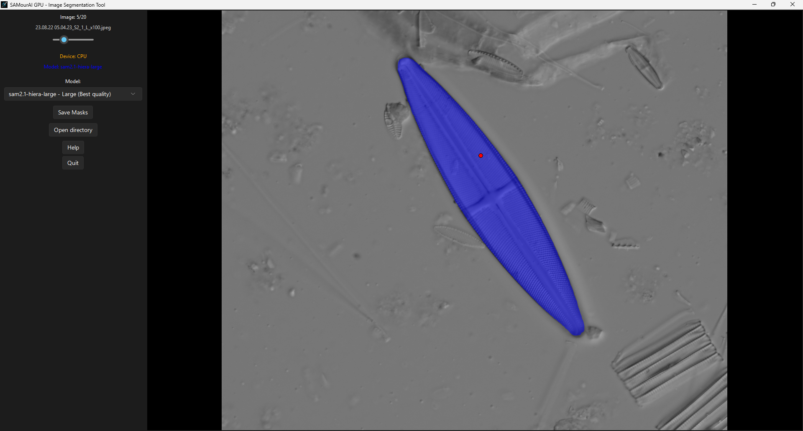

# SAMourAI — Guide d’installation et d’utilisation

*(Basé sur le dépôt [SAMBIOTIC](https://github.com/jeremyfix/sambiotic) par Jérémy Fix)*

> **Auteur :** Corentin GALINIER — Université de Lorraine
> **Date de création :** 22 octobre 2025

---

**SAMourAI** est un outil de **segmentation d’images semi-automatique**, basé sur [**SAM 2**](https://github.com/facebookresearch/sam2), développé par *Meta (Facebook Research)*.
Il fournit une **interface graphique** pour effectuer la segmentation d’images (*masks binaires .png*), disponible en modes **CPU** et **GPU**.



---

## 1. Prérequis

### Configuration matérielle

|                            | Configuration minimale                               | Configuration recommandée                           |
| -------------------------- | ---------------------------------------------------- | --------------------------------------------------- |
| **Système d’exploitation** | Windows 11 Professionnel                             | Windows 11                                          |
| **Processeur (CPU)**       | Intel Core i5-10210U (4 cœurs / 8 threads @ 1,6 GHz) | Intel Core i9-13900 (24 cœurs / 32 threads @ 2 GHz) |
| **Fabricant**              | Dell Inc.                                            | Dell Inc.                                           |
| **Modèle**                 | Latitude 5410                                        | Precision 3660                                      |
| **Carte graphique (GPU)**  | *CPU uniquement*                                     | NVIDIA RTX A2000 12 Go / GPU Apple MPS              |
| **RAM**                    | ≥ 8 Go                                               | ≥ 32 Go                                             |
| **Espace disque libre**    | ≥ 10 Go                                              | ≥ 100 Go                                            |
| **Python**                 | ≥ 3.10                                               | ≥ 3.11                                              |
| **PyTorch**                | version CPU                                          | CUDA 12.x (Windows/Linux) ou MPS (macOS)            |

> **Remarque :** SAM 2.1 peut fonctionner sans GPU, mais l’inférence sera beaucoup plus lente.
> Pour le traitement par lots ou les images haute résolution, un GPU NVIDIA (≥ 12 Go VRAM) ou Apple MPS est recommandé.

---

## 2. Installation (Windows / Linux / macOS)

### Sur Windows / Linux

1. Installer **Python 3.10 ou 3.11** depuis [python.org/downloads](https://www.python.org/downloads/).
   ➤ Vérifier l’option **“Add Python to PATH”** lors de l’installation.
2. Installer **Git** depuis [git-scm.com/downloads](https://git-scm.com/downloads).
   ➤ Activer **“Git Bash Here”** pour ajouter une option au menu contextuel.

---

### Sur macOS

1. Avec **Homebrew** :

```bash
brew install python@3.11
```

➤ Vérifier l’installation :

```bash
python3 --version
```

2. Installer Git :

```bash
brew install git
```

---

## 3. Créer un dossier de travail et cloner SAMourAI

```bash
cd ~/Documents
git clone https://github.com/cgalinier/SAMourAI.git
```

## 4. Cloner le dépôt officiel SAM 2

```bash
cd SAMourAI
git clone https://github.com/facebookresearch/segment-anything-2.git
```

## 5. Créer et activer un environnement virtuel

**Windows**

```bash
python -m venv samourai_env
samourai_env\Scripts\activate
```

**Linux / macOS**

```bash
python -m venv samourai_env
source samourai_env/bin/activate
```

> Une fois activé, le prompt affichera `(samourai_env)`.

---

## 6. Installer les dépendances

Depuis le dossier `SAMourAI/` :

```bash
pip install --upgrade pip
```
### (Windows / Linux)
#### Pour GPU NVIDIA (Windows / Linux)

```bash
pip install torch torchvision torchaudio --index-url https://download.pytorch.org/whl/cu121
pip install -r requirements.txt
```

#### Pour CPU uniquement

```bash
pip install torch torchvision torchaudio
pip install -r requirements.txt
```

### Pour macOS (CPU ou GPU Apple MPS)

```bash
pip install torch torchvision torchaudio
pip install -r requirements.txt
```

Tester le support MPS dans Python :

```python
import torch
print(torch.backends.mps.is_available())
```

Si `True` → l’accélération GPU via Metal est active.

---

## 7. Télécharger les modèles SAM 2 (checkpoints)

Ouvrir Git Bash et lancer :
```bash
mkdir -p ~/Documents/SAMourAI/checkpoints
cd ~/Documents/SAMourAI/checkpoints
curl -O https://raw.githubusercontent.com/facebookresearch/sam2/refs/heads/main/checkpoints/download_ckpts.sh
chmod +x download_ckpts.sh
./download_ckpts.sh
```

Modèles téléchargés :

* `sam2.1_hiera_tiny.pt`
* `sam2.1_hiera_small.pt`
* `sam2.1_hiera_base_plus.pt`
* `sam2.1_hiera_large.pt`

---

## 8. Configurations SAM 2

Vérifier que le dossier existe :

```
SAMourAI/segment-anything-2/sam2/configs/sam2.1/
```

Et qu’il contient :

* `sam2.1_hiera_t.yaml`
* `sam2.1_hiera_s.yaml`
* `sam2.1_hiera_b+.yaml`
* `sam2.1_hiera_l.yaml`

---

## 9. Lancer SAMourAI

Avant la 1ère utilisation, lancer depuis l'environnement virtuel:

### Windows

```bash
cd C:\Users\<user>\Documents\SAMourAI
samourai_env\Scripts\activate
pip install -r requirements.txt
```

* CPU version : lancer `SAMourAI_lite.bat`
* GPU version : lancer `SAMourAI.bat`

### Linux

```bash
cd C:\Users\<user>\Documents\SAMourAI
samourai_env\Scripts\activate
pip install -r requirements.txt
```
* CPU version:

```bash
chmod +x Linux/SAMourAI_lite.sh
./Linux/SAMourAI_lite.sh
```
➜ `SAMourAI_lite.sh` est maintenant un executable (double-clic)

* GPU version: run
```bash
chmod +x Linux/SAMourAI.sh
./Linux/SAMourAI.sh
```

➜ `SAMourAI.sh` est maintenant un executable (double-clic)

### macOS

* CPU :

```bash
source samourai_env/bin/activate
chmod +x macOS/SAMourAI_lite.sh
./macOS/SAMourAI_lite.sh
```

➜ `SAMourAI_lite.sh` est maintenant un executable (double-clic)

* GPU (Apple M1/M2/M3) :

```bash
source samourai_env/bin/activate
chmod +x macOS/SAMourAI.sh
./macOS/SAMourAI.sh
```

➜ `SAMourAI.sh` est maintenant un executable (double-clic)

---

> Les masques segmentés sont enregistrés dans le dossier `masks/`.

---

## 11. Structure du projet

```bash
SAMourAI/
├── assets/                   # Ressources (icône de l’application)
│   └── icon.ico
├── build/                    
├── checkpoints/              # Modèles pré-entraînés SAM
│   ├── sam2.1_hiera_base_plus.pt
│   └── ...
├── gui/                      # Interface graphique
│   ├── __init__.py
│   ├── gui_cpu.py            # Version CPU
│   └── gui_gpu.py            # Version GPU
├── image_dir/                # Dossier des images à segmenter
├── launchers/                # Scripts de lancement
│   ├── launcher_cpu.py
│   └── launcher_gpu.py
├── Linux/                    
│   ├── SAMourAI.sh           # Lanceur GPU Linux
│   └── SAMourAI_lite.sh      # Lanceur CPU Linux
├── macOS/
│   ├── SAMourAI.sh           # Lanceur GPU macOS
│   └── SAMourAI_lite.sh      # Lanceur CPU macOS
├── masks/                    # Dossiers des masques segmentés
├── samourai_env/             # Environnement virtuel
├── segment-anything-2/       # Dépôt SAM 2 intégré
├── LICENSE
├── README.md
├── requirements.txt
├── SAMourAI.bat              # Lanceur GPU Windows
└── SAMourAI_lite.bat         # Lanceur CPU Windows
```

---

## 11. Ressources

* **SAMBIOTIC** : [https://github.com/jeremyfix/sambiotic](https://github.com/jeremyfix/sambiotic)
* **Documentation SAM 2** : [https://github.com/facebookresearch/sam2](https://github.com/facebookresearch/sam2)
